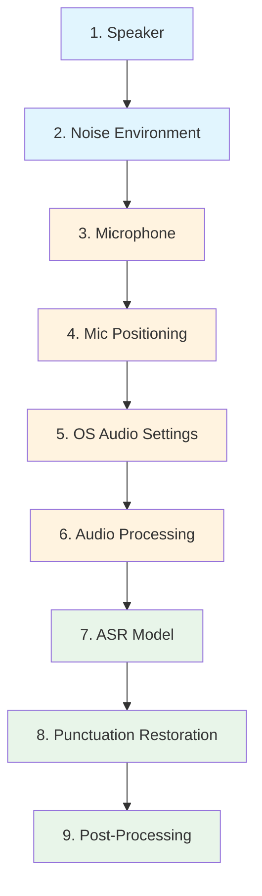

# The Speech-To-Text Chain

By: Daniel Rosehill
Date: Dec 09, 2025

The purpose of this collection of notes is to provide an enumeration of the different factors that in my experience make the difference between partial and higher levels of success in speech to text workflows. 

What I've learned over the course of using speech to text intensively and daily for just over a year now is that the ultimate word error rate or accuracy of ASR is a composite of factors rather than just about using a better model. 

What I've also learned: it's possible to achieve high levels of accuracy with relatively small models by attempting to improve some of these constituent elements. This is particularly important and relevant when trying to achieve performant ASR on devices with limited compute, such as embedded hardware. 

For example:

- Fine tune a small model on your vocabulary and speech to get outsized accuracy.  
- Add a noise cleanup as a post processing workflow before setting it for a transcription.  
- Record in a better environment and with a better microphone.  

This applies across the range of ASR applications. 

I thought it would be useful to enumerate these and to try to order them in a "chain." The practical application for this is informing the design and development of a couple of ASR projects that I'm working on. 

## The Chain

## Chain Components

| Step | Component | Type | Description |
|------|-----------|------|-------------|
| 1 | [The Speaker](the-chain/the-speaker.md) | Human | Clarity of speech and pronunciation |
| 2 | [The Noise Environment](the-chain/the-noise-environment.md) | Environmental | Background noise, competing audio sources |
| 3 | [The Microphone](the-chain/the-microphone.md) | Hardware | Microphone type, wired vs wireless, codec |
| 4 | [Microphone Positioning](the-chain/mic-positioning.md) | Hardware | Polar patterns, address angle, distance |
| 5 | [OS Audio Settings](the-chain/os-audio-settings.md) | Software | Gain, sample rate, system audio processing |
| 6 | [Audio Processing](the-chain/audio-processing.md) | Software | Noise reduction, audio enhancement |
| 7 | [The ASR Model](the-chain/asr-model.md) | AI/ML | Speech-to-text model selection and configuration |
| 8 | [Punctuation Restoration](the-chain/puncutation.md) | AI/ML | Adding punctuation, VAD, diarisation |
| 9 | [Post-Processing](the-chain/postprocessing.md) | AI/ML | LLM cleanup, formatting, filler removal |

## Component Categories

- **Human/Environmental** (blue): Factors relating to the speaker and their surroundings
- **Hardware/Signal** (orange): Physical capture and signal processing
- **AI/ML Processing** (green): Model-based transcription and refinement
